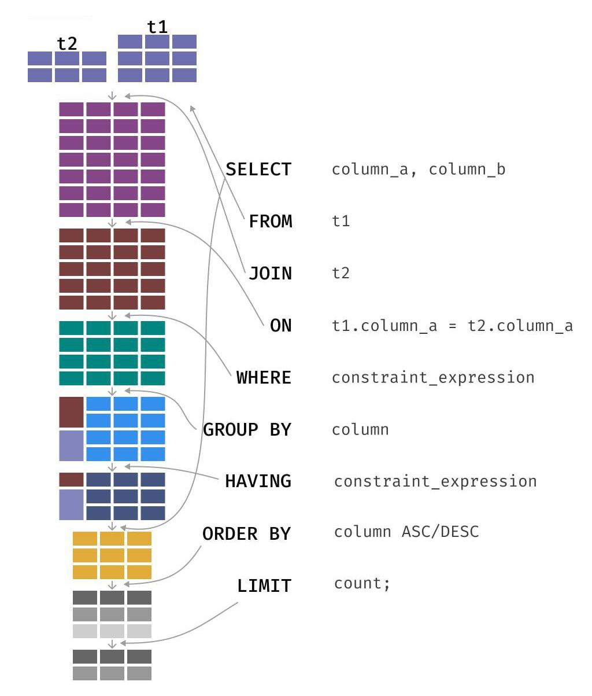

1. Укажите, в каком порядке призводится написание команд при выборе данных из таблицы. Также укажите, в каком порядке команды выполняются при запуске отработки запроса.

- порядок их написания:

```
SELECT
FROM
JOIN
WHERE
GROUP BY
HAVING
ORDER BY
LIMIT
```

- порядок их выполнения:

```
FROM
JOIN
WHERE
GROUP BY
HAVING
SELECT
ORDER BY
LIMIT
```

- Сначала с помощью FROM определяем откуда будем брать данные
- Потом с помощью JOIN мы формируем таблицу, с которой потом будем работать
- В соответствии с WHERE отбираем записи
- Выбранные данные группируются и агрегируются с помощью GROUP BY
- Далее отбираем те, которые удовлетворяют условию HAVING
- Только после этого формируем таблицу с присваиванием необходимых алиасов с помощью SELECT
- Сортируем таблицу с помощью ORDER BY
- Лимит на ограничение вывода строк LIMIT

Подробная схема работы указана на рисунке ниже




2. Какая команда позволит вам удалить строки таблицы по условию? Можно ли удалить таблицу с помощью данной команды?

```
DELETE FROM (table) WHERE (smth)
```

Также можно удалить все строки из таблицы (просто не пишем условие), но удалить таблицу такой командой нлеьзя. Для этого существует другая

```
DROP TABLE (table)
```

7. Работает ли приведенный код?

- Нет - он не будет работать, поскольку в условии WHERE указана колонка diff, которая не существует на момент отсева по этому условию (так как такое название появится только после срабатывания SELECT, который работает позже WHERE)